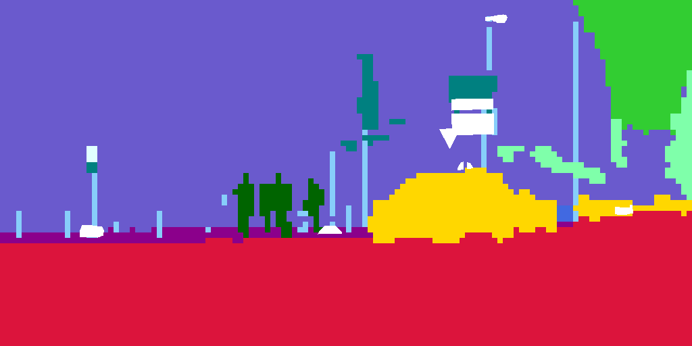
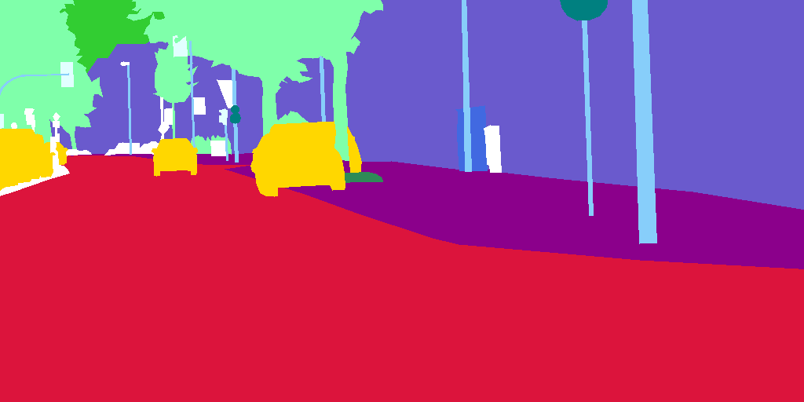
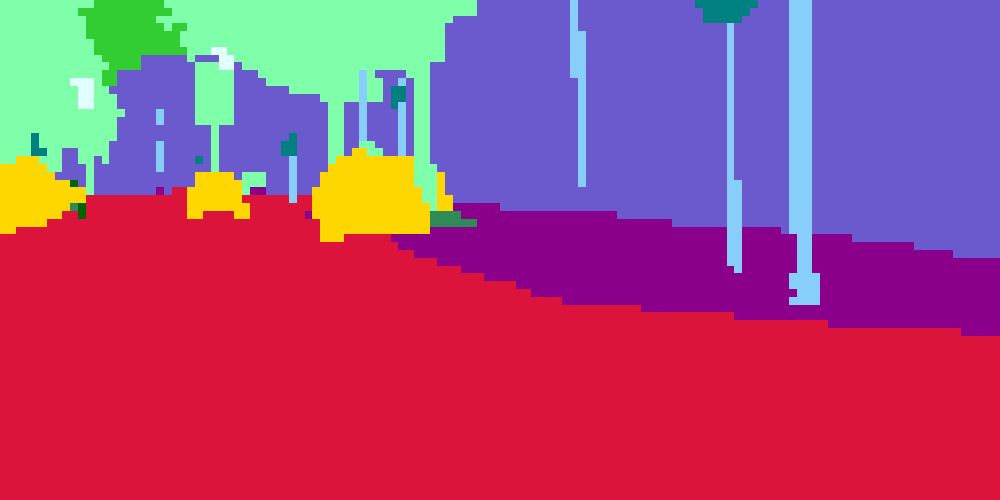

# Adaptive Pyramid Context Network for Semantic Segmentation


| **ackbone**        | **Resnet101_v1c** |
| ------------------ | ----------------- |
| **Decode Head**    | **APCHead**       |
| **Auxiliary Head** | **FCNHead**       |










## Environment


```shell
#torch 1.8.0
conda install pytorch==1.8.0 torchvision==0.9.0 torchaudio==0.8.0 cudatoolkit=10.2 -c pytorch
pip install mmcv-full -f https://download.openmmlab.com/mmcv/dist/cu102/torch1.8.0/index.html
pip install prettytable
#paddle
python -m pip install paddlepaddle-gpu -i https://mirror.baidu.com/pypi/simple
```


## Pretrained model：

```yml
#mmcv resnet101_v1c  mmcv/model_zoo/open_mmlab.json:
"resnet101_v1c": "https://download.openmmlab.com/pretrain/third_party/resnet101_v1c-e67eebb6.pth"
```


## Weight tranpose：

```shell
cd paddle_apcnet/architectures
cp apcnetxxx_torch.pth paddle_apcnet/architectures/pretrained/apcnetxxx_torch.pth
python torchModel2pdModel.py #generate apcnetxxx_paddle.pdparams
```


## Dataset：

### Cityscapes:

gtFine 5000

1. Downdown to ./dataset

2. sh prepare.sh
3. cd cityscapesscripts/preparation
4. python createTrainIdLabelImgs.py


## Train:

Paddle:

```shell
cd paddle_apcnet
sh paddle.sh
```


Torch:

```shell
cd torch_apcnet
sh torch.sh
```


## Test:

Paddle:

```shell
cd paddle_apcnet
python test.py
```


## Measure：

| Model               | mIou   |
| ------------------- | ------ |
| APCNet(torch)       | 79.08% |
| APCNet(paddle)      | 78.95% |
| APCNet+CRFs(paddle) | 72.47% |


